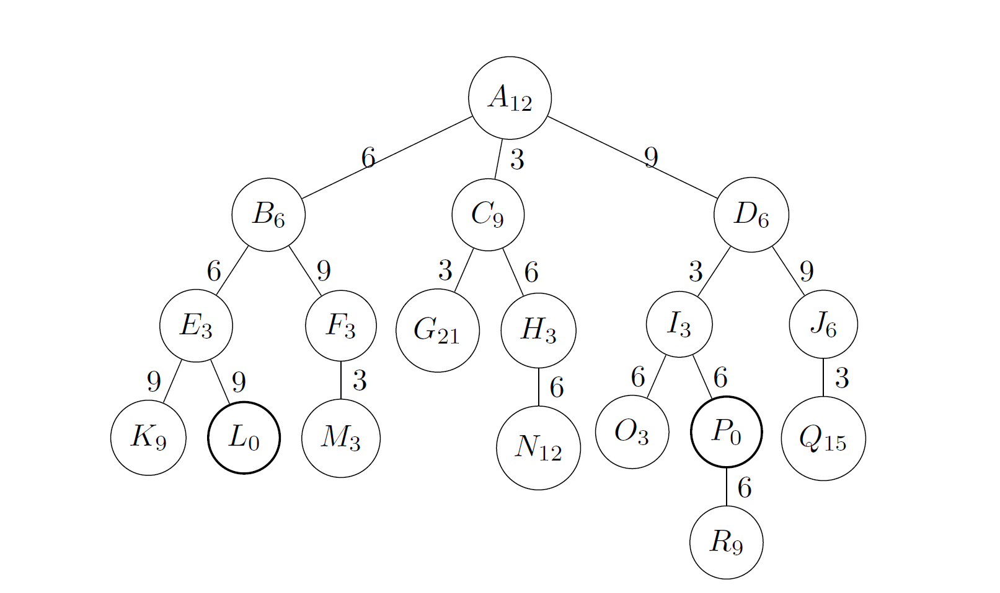

% Artificial Intelligence \
 Homework 2, Part B
% Alic Szecsei
% February 21, 2019

# Search Strategies

Which of the following are true and which are false? _Explain your answer._

1. Depth-first search always expands at least as many nodes as A\* search with an admissable heuristic.
2. $h(n) = 0$ is an admissable heuristic for the 8-puzzle.
3. A\* is of no use in robotics because percepts, states, and actions are continuous.
4. Breadth-first search is complete even if zero step costs are allowed.
5. In chess, Manhattan distance is an admissable heuristic for the problem of moving a rook from square A to square B in the smallest number of moves.[^1]
6. Suppose that for a given problem you have an admissable heuristic $h$. Let $h'$ be such that $h'(n) = h(n) + k$ for every node $n$ where $k$ is a positive constant. Then, we are guaranteed to find the optimal solution even if we use A\* with $h'$ instead of $h$.

[^1]: Recall that a rook can move on a chessboard any number of squares in a straight line, vertically or horizontally, but cannot jump over other pieces.

## Solution

1. **False** - assume the search tree is very shallow but very wide, with a constant cost for each edge. As an example, suppose the root has 8 children, which each have 8 children themselves. The node we are looking for is the first child of the first child. Then, we can give A\* the trivial heuristic of $h(n) = 0$, which causes A\* to become equivalent to breadth-first search. Now A\* will expand all sibling nodes, while depth-first search will find the solution earlier (depth-first search will expand 2 nodes, while A\* will expand 9).
2. **True** - For the 8-puzzle, costs are strictly positive (as you cannot have a negative number of moves). An admissable heuristic is one which never _over-estimates_ the cost of reaching the goal - since 0 is less than any positive value, we are guaranteed that $h(n) = 0$ will produce an under-estimate every time.
3. **False** - in robotics, planning is very important (just look at the UICC keynote topic!), and A\* is useful for making initial plans (or updating plans at discrete intervals). In fact, robotics sensors aren't actually continuous, they just have very high update frequencies.
4. **True** - breadth-first search is always complete.
5. **True** - a rook can only move left, right, up, or down (until it is blocked by another piece). Thus, the actual distance traveled will always be equal to or greater than the Manhattan distance - in other words, this heuristic cannot over-estimate the cost, and is thus admissible.
6. **True** - the danger of inadmissible heuristics in A\* is that A\* may avoid a low-cost path because the heuristic makes it seem very costly. If all paths have the same alteration, the cost comparisons between them are maintained; even when paths are taken, A\* uses the actual cost. Thus, the cost of a path $p$ is $C_0 + C_1 ... + k$, where $C_n$ is the actual cost of a node $n$. When we compare this to any other path in the priority queue, both sides have a single $k$ constant, which can be removed when we compare them.

\clearpage

# Practice with Search Strategies

Consider the search tree given in Figure 1. The letter inside a node $n$ is the name of the (state represented by that) node. The subscript of the letter is the heuristic estimate $h(n)$ of the cost of getting from $n$ to the least-cost goal. The number on each edge $(n_1, n_2)$ is the step cost of going from the state in $n_1$ to the state in $n_2$. The actual cost of going from a node $n_1$ to a node $n_2$ along a connecting path $p$ is the sum of the step costs along $p$. The initial node is the root node $A$. Goal nodes are represented by thicker circles (nodes $L$ and $P$).

1. Using the general tree-search algorithm in Figure 3.7 of the textbook, perform a search of the tree according to each of the following search strategies. Make sure to _follow the algorithm, not just your intuitive understanding of each search strategy._

   a. Breadth-first
   b. Uniform cost
   c. Greedy best-first
   d. A\*
   e. Hill-climbing (for this tree, smaller values are better)
   f. Local beam search with number of nodes $k = 2$ and initial nodes $B$ and $D$ (again, smaller values are better).

   Treat the frontier as a priority queue ordered by an appropriate evaluation function. For each strategy:

   - Specify what evaluation function and additional restrictions on the queue are needed for the general algorithm in Figure 3.7 to implement that strategy.
   - Show the nodes in the order they are removed from the queue (the frontier) for expansion. For each removed node, show the queue produced after the expansion of the node. Write the queue from left to right. When you order the queue, if two nodes have the same value, sort them alphabetically. Add to each node, as a subscript, the value being used to sort that node, if any.

   Your solution should look something like:

   | Node expanded | Queue             |
   | ------------- | ----------------- |
   | -             | $(A_0)$           |
   | $A_0$         | $(B_5, C_6, D_7)$ |
   | $B_5$         | $(C_6, D_7, E_8)$ |
   | ...           | ...               |

   showing the node expanded at a particular time step, and the queue resulting from expanding that node.

2. Which strategies found the optimal (least-cost) solution to the problem?

## Solution

### Question 1

1. **Breadth-First Search**

Here, the evaluation function for a node is its depth: the deeper the node, the less we should prioritize it.

| Node expanded | Queue                                 |
| ------------- | ------------------------------------- |
| -             | $(A_0)$                               |
| $A_0$         | $(B_1, C_1, D_1)$                     |
| $B_1$         | $(C_1, D_1, E_2, F_2)$                |
| $C_1$         | $(D_2, E_2, F_2, G_2, H_2)$           |
| $D_1$         | $(E_2, F_2, G_2, H_2, I_2, J_2)$      |
| $E_2$         | $(F_2, G_2, H_2, I_2, J_2, K_3, L_3)$ |
| $F_2$         | $(G_2, H_2, I_2, J_2, K_3, L_3, M_3)$ |
| $G_2$         | $(H_2, I_2, J_2, K_3, L_3, M_3)$      |
| $H_2$         | $(I_2, J_2, K_3, L_3, M_3, N_3)$      |
| $I_2$         | $(J_2, K_3, L_3, M_3, N_3, O_3, P_3)$ |
| $J_2$         | $(K_3, L_3, M_3, N_3, O_3, P_3, Q_3)$ |
| $K_3$         | $(L_3, M_3, N_3, O_3, P_3, Q_3)$      |
| return $L_3$  | -                                     |

2. **Uniform Cost**

The evaluation function for Uniform Cost is the _actual_ cost of reaching a node. Thus, as we traverse the tree, we seek the path of least resistance.

| Node expanded   | Queue                                                      |
| --------------- | ---------------------------------------------------------- |
| -               | $(A_0)$                                                    |
| $A_0$           | $(C_3, B_6, D_9)$                                          |
| $C_3$           | $(B_6, G_6, D_9, H_9)$                                     |
| $B_6$           | $(G_6, D_9, H_9, E_{12}, F_{15})$                          |
| $G_6$           | $(D_9, H_9, E_{12}, F_{15})$                               |
| $D_9$           | $(H_9, E_{12}, I_{12}, F_{15}, J_{18})$                    |
| $H_9$           | $(E_{12}, I_{12}, F_{15}, N_{15}, J_{18})$                 |
| $E_{12}$        | $(I_{12}, F_{15}, N_{15}, J_{18}, K_{21}, L_{21})$         |
| $I_{12}$        | $(F_{15}, N_{15}, J_{18}, O_{18}, P_{18}, K_{21}, L_{21})$ |
| $F_{15}$        | $(N_{15}, J_{18}, M_{18}, O_{18}, P_{18}, K_{21}, L_{21})$ |
| $N_{15}$        | $(J_{18}, M_{18}, O_{18}, P_{18}, K_{21}, L_{21})$         |
| $J_{18}$        | $(M_{18}, O_{18}, P_{18}, K_{21}, L_{21}, Q_{21})$         |
| $M_{18}$        | $(O_{18}, P_{18}, K_{21}, L_{21}, Q_{21})$                 |
| $O_{18}$        | $(P_{18}, K_{21}, L_{21}, Q_{21})$                         |
| return $P_{18}$ | -                                                          |

3. **Greedy Best-First**

Here, the evaluation function is $h(n)$; we head wherever our heuristic tells us to.

| Node expanded | Queue                     |
| ------------- | ------------------------- |
| -             | $(A_0)$                   |
| $A_0$         | $(B_6, D_6, C9)$          |
| $B_6$         | $(E_3, F_3, D_6, C9)$     |
| $E_3$         | $(L_0, F_3, D_6, C9, K9)$ |
| return $L_0$  | -                         |

4. **A\***

The evaluation function for A\* is $h(n) + c(n)$, where $c(n)$ is the actual cost of reaching a node.

| Node expanded   | Queue                                                              |
| --------------- | ------------------------------------------------------------------ |
| -               | $(A_{12})$                                                         |
| $A_{12}$        | $(B_{12}, C_{12}, D_{15})$                                         |
| $B_{12}$        | $(C_{12}, D_{15}, E_{15}, F_{18})$                                 |
| $C_{12}$        | $(H_{12}, D_{15}, E_{15}, F_{18}, G_{27})$                         |
| $H_{12}$        | $(D_{15}, E_{15}, F_{18}, G_{27}, N_{27})$                         |
| $D_{15}$        | $(E_{15}, I_{15}, F_{18}, J_{24}, G_{27}, N_{27})$                 |
| $E_{15}$        | $(I_{15}, F_{18}, L_{21}, J_{24}, G_{27}, N_{27}, K_{30})$         |
| $I_{15}$        | $(F_{18}, P_{18}, L_{21}, O_{21}, J_{24}, G_{27}, N_{27}, K_{30})$ |
| $F_{18}$        | $(P_{18}, L_{21}, M_{21}, O_{21}, J_{24}, G_{27}, N_{27}, K_{30})$ |
| return $P_{18}$ | -                                                                  |

5. **Hill-Climbing**

Here, our evaluation function is $h(n)$, and we must clear the queue after we select a node.

| Node expanded | Queue                   |
| ------------- | ----------------------- |
| -             | $(A_{12})$              |
| $A_{12}$      | $(B_{6}, D_{6}), C_{9}$ |
| $B_6$         | $(E_3, F_3)$            |
| $E_3$         | $(L_0, K_9)$            |
| return $L_0$  | -                       |

6. **Local Beam Search**

Similar to Hill-Climbing, we use $h(n)$ as our evaluation function, but we are allowed to select two nodes from our queue at once. Still, we have to clear our queue after selecting these two nodes.

| Node expanded | Queue                  |
| ------------- | ---------------------- |
| -             | $(B_6, D_6)$           |
| $B_6, D_6$    | $(E_3, F_3, I_3, J_6)$ |
| $E_3, F_3$    | $(L_0, M_3, K_9)$      |
| return $L_0$  | -                      |

### Question 2

The algorithms that found the optimal solution were **Uniform Cost** and **A\***.
