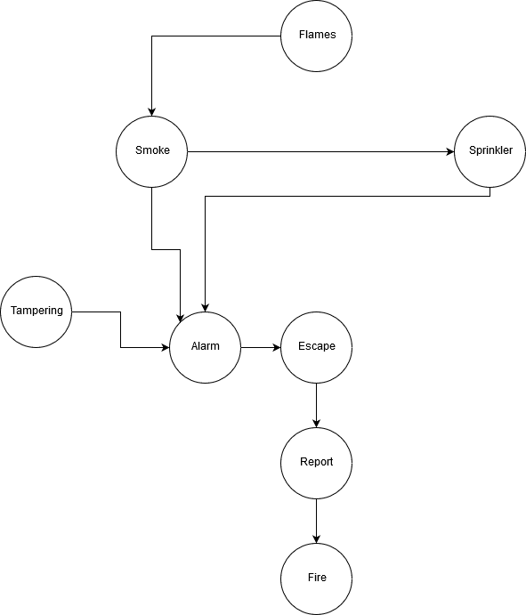
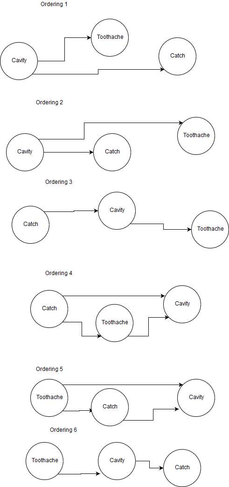

% Artificial Intelligence \
 Homework 5
% Alic Szecsei
% April 12, 2019

# 1. Probability Theorems

1. $P(\alpha | \beta \wedge \alpha) = 1$ whenever $P(\beta \wedge \alpha) \neq 0$

   Proof: Assume that $P(\beta \wedge \alpha) \neq 0$. Then $P(\alpha | \beta \wedge \alpha) = \frac{P(\alpha \wedge (\beta \wedge \alpha))}{P(\beta \wedge \alpha)}$ by the definition of conditional probability. By logical equivalence, this is $\frac{P(\beta \wedge \alpha)}{P(\beta \wedge \alpha)}$, which is equal to $1$.

2. $P(\alpha) = P((\alpha \wedge \beta) \vee (\alpha \wedge \neg \beta))$

   Proof: By logical equivalence, we can rearrange terms from $P((\alpha \wedge \beta) \vee (\alpha \wedge \neg \beta))$ to $P(\alpha \wedge (\beta \vee \neg \beta))$. Since $\beta \vee \neg \beta$ is a tautology, we can further reduce this via logical equivalence to $P(\alpha)$, which is what we wanted to show.

3. $P(\alpha) = P(\alpha | \beta)P(\beta) + P(\alpha | \neg \beta)P(\neg beta)$

   Proof: By the definition of conditional probability, $P(\alpha | \beta)P(\beta) + P(\alpha | \neg \beta)P(\neg \beta) = \frac{P(\alpha \wedge \beta)}{P(\beta)}P(\beta) + \frac{P(\alpha \wedge \neg \beta)}{P(\neg \beta)}P(\neg \beta)$. This can be further reduced to $P(\alpha \wedge \beta) + P(\alpha \wedge \neg \beta)$; this is equivalent to $P((\alpha \wedge \beta) \vee (\alpha \wedge \neg \beta))$ since $P((\alpha \wedge \beta) \wedge (\alpha \wedge \neg \beta)) = 0$. By the previous problem, this is equivalent to $P(\alpha)$.

4. $P(\alpha | \beta) = 1 - P(\neg \alpha | \beta)$

   Proof: By the definition of conditional probability, $P(\alpha | \beta) = \frac{P(alpha \wedge beta)}{P(\beta)}$. Due to axiom 2, $P(\alpha) = 1 - P(\neg \alpha)$, and so $P(\alpha \wedge \beta) = P(\beta) - P(\neg \alpha \wedge \beta)$. Substituting this in the original equation gives $\frac{P(\beta) - P(\neg \alpha \wedge beta)}{P(\beta)}$, which reduces to $1 - \frac{P(\neg \alpha \wedge beta)}{P(\beta)}$. By the definition of conditional probability, this is equivalent to $1 - P(\neg \alpha | \beta)$, which is what we wanted to show.

# 2. Probabilistic Reasoning

Let's say that $P(\alpha)$ is the probability of the engine actually being cracked. The knowledge that only one in 10,000 cars of my specific model having this issue seems to place $P(\alpha)$ at $\frac{1}{10,000}$ - a fairly low chance!

However, I have extra information. The computer is reporting a cracked engine, with 99% accuracy. This extra information updates my model - now, rather than the naive belief that I have a 0.001% chance of my engine being cracked, I have a 99% chance of this being the case (since I know that the check engine light is on).

Given my knowledge of the situation (namely, the check engine light being on), and the consequences of such a fault (potential death for myself and others if I choose to ignore the alarm and am wrong, versus a monetary loss if I choose to replace the engine and don't need to) I cannot ignore the alarm and should replace the engine.

# 3. Constructing Belief Networks I

## Belief Network

## Flames

| P(Flames) |
| --------- |
| 0.1       |

## Smoke

| Flames | P(Smoke) |
| ------ | -------- |
| T      | 0.8      |
| F      | 0.1      |

## Sprinkler

| Smoke | P(Sprinkler) |
| ----- | ------------ |
| T     | 0.9          |
| F     | 0.01         |

## Tampering

| P(Tampering) |
| ------------ |
| 0.1          |

## Alarm

| Smoke | Sprinkler | Tampering | P(Alarm) |
| ----- | --------- | --------- | -------- |
| T     | T         | T         | 0.9      |
| T     | T         | F         | 0.99     |
| T     | F         | T         | 0.9      |
| T     | F         | F         | 0.92     |
| F     | T         | T         | 0.8      |
| F     | T         | F         | 0.89     |
| F     | F         | T         | 0.8      |
| F     | F         | F         | 0.01     |

## Escape

| Alarm | P(Escape) |
| ----- | --------- |
| T     | 0.9       |
| F     | 0.2       |

## Report

| Escape | P(Report) |
| ------ | --------- |
| T      | 0.9       |
| F      | 0.1       |

## Fire

| Report | P(Fire) |
| ------ | ------- |
| T      | 0.7     |
| F      | 0.1     |

# 4. Constructing Belief Networks II

# 5. Querying Belief Networks

1. $P(W | S \wedge \neg R \wedge C)$

   From the CPT, we see that $P(W | S \wedge \neg R)$ is 0.90. Due to the conditional independence of belief networks, $P(W | S \wedge \neg R) = P(W | S \wedge \neg R \wedge C)$. Thus, the end result is 0.90.

2. $P(\neg R | C)$

   From the CPT, we see that $P(R | C) = 0.80$; since $P(\neg A) = 1 - P(A)$, we can say that $P(\neg R | C) = 1 - 0.8 = 0.2$.

3. $P(S | R \wedge C)$

   Since $S$ and $R$ are conditionally independent, $P(S | R \wedge C) = P(S | C) = 0.10$.

4. $P(S)$

   From 1.3 above, we see that $P(S) = P(S | C)P(C) + P(S | \neg C)P(\neg C) = 0.1 * 0.5 + 0.5 * 0.5 = 0.3$.

5. $P(R)$

   Again, $P(R) = P(R | C)P(C) + P(R | \neg C)P(\neg C) = 0.8 * 0.5 + 0.2 * 0.5 = 0.5$.

6. $P(S \wedge R | \neg C)$

   Since $S$ and $R$ are conditionally independent given $C$, $P(S \wedge R | C) = P(S | C)P(R | C) = 0.1 * 0.8 = 0.08$.

7. $P(S \wedge R)$

   $P(S \wedge R) = P(S | R)P(R)$; since $S$ and $R$ are conditionally independent, $P(S | R) = P(S)$, so $P(S \wedge R) = P(S)P(R) = 0.3 * 0.5 = 0.15$.

8. $P(S \wedge \neg R)$

   Since $P(\neg R) = 1 - P(R)$, the expression in 5.7 above is $P(S \wedge \neg R) = P(S)P(\neg R) = P(S)(1 - P(R)) = P(S) - P(S)P(R) = 0.3 - 0.15 = 0.15$.
